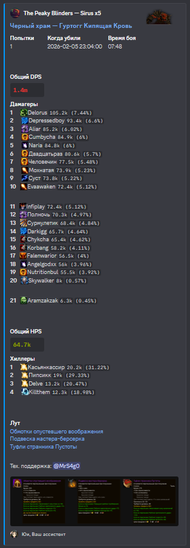
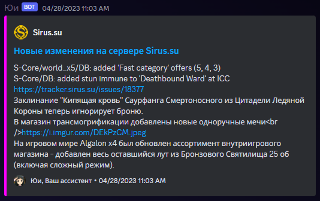

# Юи - дискорд бот для сервера Sirus.su

Бот назван в честь искусственного интелекта по имени [Юи](https://sword-art-online.fandom.com/ru/wiki/%D0%AE%D0%B8) из тайтла [Sword Art Online](https://sword-art-online.fandom.com/ru/wiki/Sword_Art_Online_%D0%92%D0%B8%D0%BA%D0%B8).

## Основные возможности

1. Вывод гильдейских убийств боссов с отображением списка топ дпс и скриншотом лута

    

2. Мониторинг [списка изменений](https://sirus.su/statistic/changelog) Sirus.su

    

## Установка бота

1. [Инвайт ссылка](https://discord.com/api/oauth2/authorize?client_id=1048561255989919795&permissions=8&scope=bot%20applications.commands) (необходимы права администратора)

2. Установить необходимые каналы

    Для использования этих команд необходима роль с правами бана.

    2.1. `/setlootchannel [channel] [realm_id] [guild_sirus_id]` - устанавливает канал для вывода убийства боссов

    - channel - канал для вывода сообщений
    - realm_id - реалм (выбирается из списка)
    - guild_sirus_id - ID гильдии

    ID гильдии можно узнать зайдя на страницу гильдии. Например, ссылка на гильдию *North Mythology-x4*: <https://sirus.su/base/guilds/33/247/>. Тогда ID это последнее число в ссылке, в данном случае **247**.

    2.2. `/setlogchannel [channel]` - устанавливает канал для вывода списка изменений

    - channel - канал для вывода сообщений

## Для связи и дополнительной инфой

- Discord: MrS4g0#1337

---

## Для разработчиков

Установка пакетов: `npm install`

Содержимое .env файла

- `token` - токен *вашего* дискорд бота
- `client_id` - ID клиента *вашего* дискорд бота

Для отображения кастомных смайлов напротив ников необходимо прописать их ID в файле `loot/classEmoji.json` параметра `emoji_id`

Запуск: `node .`

При первом запуске будут сообщения об ошибках, что файлы настроек не загружены. Они будут созданы при использовании команд `/setlootchannel` и `/setlogchannel`
